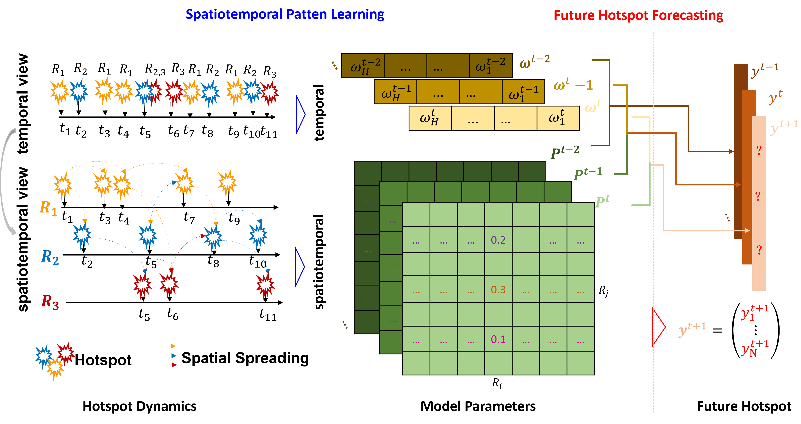
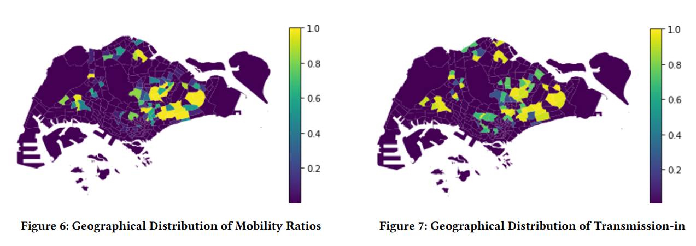
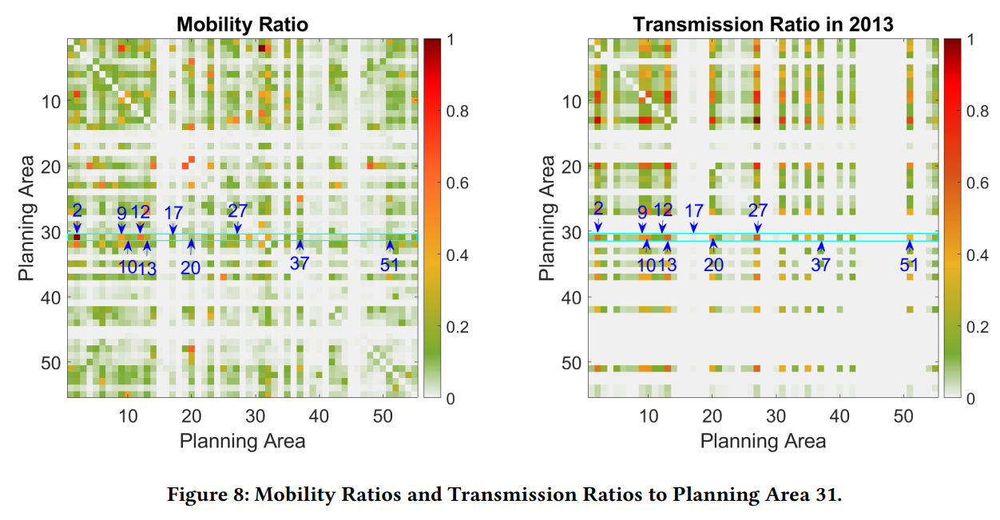

# Mining Citywide Dengue Spread Patterns

Dengue, a mosquito-borne disease, continues to pose a persistent public health challenge in urban areas, particularly in tropical regions such as **Singapore**. Effective and affordable control requires anticipating where transmission risks are likely to emerge so that interventions can be deployed **proactively rather than reactively**.

***

## 📰 Publication
This work has been accepted for publication at **The Web Conference 2026 (WWW 2026)**.

**arXiv Preprint:** [https://arxiv.org/abs/2601.12856](https://arxiv.org/abs/2601.12856)

***

## 🚀 Overview
This study introduces a novel framework that uncovers and exploits **latent transmission links** between urban regions, mined directly from publicly available dengue case data. Instead of treating cases as isolated reports, we model how hotspot formation in one area is influenced by epidemic dynamics in neighboring regions.

### Key Insights:
* **Spatial Spreading Network:** While mosquito movement is highly localized, **long-distance transmission is often driven by human mobility**. In our case study, the learned network aligns closely with commuting flows, providing an interpretable explanation for citywide spread.
* **Latent Network Learning:** These hidden links that represents the latent spatial spreading network are optimized through **gradient descent**.
* **Forecasting & Verification:** The framework is not only evaluated by **forecasting hotspot status** but also be verified for **the consistency of spreading patterns** via examining the stability of the inferred network across consecutive weeks.

## 📊 Case Study Results (Singapore)
Experiments conducted on data from 2013–2018 and 2020 demonstrate the model's effectiveness:

* **Baseline Performance:** Four weeks of hotspot history are sufficient to achieve an average **F-score of 0.79**.
* **Robustness:** Even during the **COVID-19 “circuit breaker”**, when mobility patterns were severely disrupted, the model remained robust with an **F-score of 0.83**.
* **Interpretability:** The learned transmission links align with commuting flows, highlighting the interplay between hidden epidemic spread and human mobility.
* **Visualization: ** The comparison between commuting flows and the learned dengue spreading pattern is as following figures. Analysis details can be found in the paper.

## 💡 Impact
By shifting from simply reporting dengue cases to **mining and validating hidden spreading dynamics**, this work transforms open web-based case data into a predictive and explanatory resource. The proposed framework advances epidemic modeling while providing a **scalable, low-cost tool** for:
1.  Public health planning
2.  Early intervention
3.  Urban resilience
